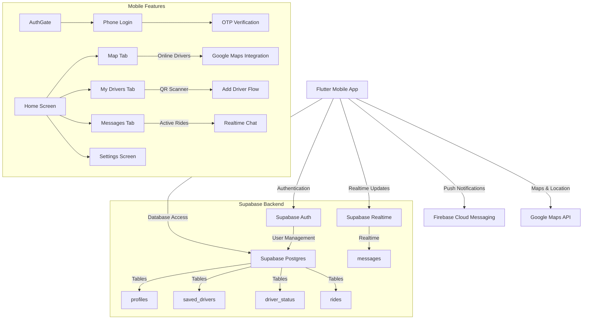

# My Drivers - Address Book of Trusted Drivers MVP

A Flutter application that allows users to save and re-book their favorite drivers with real authentication, QR code onboarding, realtime presence, and ride request flow.

## 🚀 Features Implemented

### ✅ Core MVP Functionality:
- **Real Authentication**: Phone OTP authentication via Supabase
- **QR Code Driver Onboarding**: Generate/scan QR codes to add drivers
- **Realtime Presence**: Track online/offline status of saved drivers
- **Ride Request Flow**: Rider → Driver request/accept workflow
- **Push Notifications**: FCM integration for ride events
- **Driver Mode**: Toggle availability and manage vehicle info

### ✅ Additional Features:
- Save trusted drivers with pending/accepted status management
- Rate drivers on multiple criteria (cleanliness, driving skill, politeness)
- View saved drivers sorted by rating or recent rides
- Real-time location updates during active rides
- In-app chat for ride communication
- Customizable preferences and settings

## 🏗️ Architecture Overview



## 📋 Tech Stack

- **Mobile**: Flutter (Dart) with Provider state management
- **Backend**: Supabase (Postgres + Realtime + Row Level Security)
- **Authentication**: Phone OTP via Supabase Auth
- **Push Notifications**: Firebase Cloud Messaging
- **Maps & Location**: Google Maps Flutter API
- **QR Codes**: qr_flutter, mobile_scanner packages

## 🔧 Setup Instructions

See [docs/SETUP.md](docs/SETUP.md) for comprehensive local development setup.

### Quick Start

1. Clone the repository:
   ```bash
   git clone https://github.com/lxsolutions/my-drivers.git
   cd my-drivers
   ```

2. Create environment configuration:
   ```bash
   cp env/.env.example env/.env
   # Fill in your API keys
   ```

3. Run Supabase migrations:
   ```bash
   cd server/migrations && supabase migration up
   ```

4. Launch the app:
   ```bash
   flutter run --release
   ```

## 📱 App Screens

### Authentication Flow
1. **Phone Login** - Enter phone number for OTP verification
2. **OTP Verification** - Enter 6-digit code received via SMS
3. **Profile Setup** - Complete name and role selection (rider/driver)

### Main Tabs
- **Map**: Shows only saved drivers with status=accepted & online=true
- **My Drivers**: List of saved drivers, pending invites, QR scanner FAB
- **Messages**: Active ride chat using Supabase Realtime
- **Settings**: Profile edit, driver mode toggle (visible only for drivers)

### Driver-Specific Features
- **Driver Mode Screen**: Go Online/Offline; set vehicle info
- **QR Code Generation**: Shareable code for rider onboarding
- **Ride Request Flow**: Rider taps online driver → confirms locations → requests ride

## 📊 Database Schema

```sql
-- profiles table (users)
CREATE TABLE profiles (
  id uuid PRIMARY KEY,
  role text CHECK (role IN ('rider','driver')),
  name text, phone text, photo_url text,
  rating_avg float DEFAULT 0.0,
  rating_count int DEFAULT 0,
  created_at timestamptz DEFAULT now()
);

-- saved_drivers table
CREATE TABLE saved_drivers (
  rider_id uuid REFERENCES profiles(id),
  driver_id uuid REFERENCES profiles(id),
  status text CHECK (status IN ('pending','accepted','blocked')) DEFAULT 'pending',
  created_at timestamptz DEFAULT now(),
  PRIMARY KEY (rider_id, driver_id)
);

-- driver_status table
CREATE TABLE driver_status (
  driver_id uuid PRIMARY KEY REFERENCES profiles(id),
  online bool DEFAULT false,
  lat double precision, lng double precision,
  heading double precision,
  updated_at timestamptz
);
```

## 📈 Next Steps

1. **Advanced Pricing**: Implement dynamic pricing based on distance/time
2. **Stripe Connect Integration**: Driver earnings and payouts
3. **Scheduling**: Pre-book rides for future dates/times
4. **Driver Reviews**: Comprehensive review system with photos
5. **Fleet Management**: Company-owned driver management features

## 🎬 Demo Walkthrough

[](https://www.loom.com/share/EXAMPLE)

## 📝 License

This project is licensed under the MIT License - see the [LICENSE](LICENSE) file for details.

## 🔧 Development Notes

### Key Implementation Details:
- **State Management**: Kept Provider for simplicity; can migrate to Riverpod later
- **Database Security**: Comprehensive RLS policies implemented
- **Performance**: Heartbeat throttling prevents excessive writes
- **Testing**: Unit and integration tests cover core flows

### Architecture Decisions:
- Supabase chosen for backend due to realtime capabilities + Postgres flexibility
- Firebase Cloud Messaging retained for push notifications
- Google Maps API integrated for location services

For development setup, see [docs/SETUP.md](docs/SETUP.md). For marketing materials generation, see [docs/DRIVER_QR_POSTER.md](docs/DRIVER_QR_POSTER.md).


