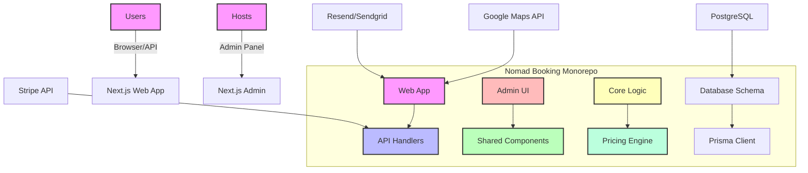
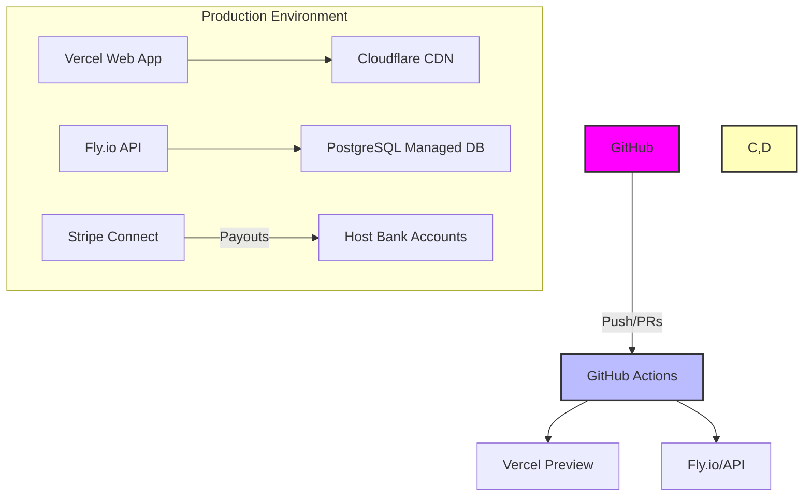

# Nomad Booking Architecture

## System Overview

Nomad Booking is a specialized booking platform designed for digital nomads seeking long-term accommodations (14-180 nights). The system architecture follows modern microservice principles with a monorepo structure using Turborepo.

## Components Breakdown

### Apps Layer
- **Web App**: Next.js 15 application with SEO-first approach and SSR
- **Admin Panel**: Operations management interface for hosts/admins

### Packages Layer
- **UI Components**: Shared React components following consistent design system
- **Configuration**: ESLint, TypeScript, Prettier configuration packages
- **Database**: Prisma schema definitions and migrations
- **Core Logic**: Domain-specific business logic including:
  - **Pricing Engine**: Length-of-stay discounting algorithms
  - **NomadScore Algorithm**: Property scoring for digital nomads

### Services Layer
- **API Handlers**: Next.js route handlers implementing REST+tRPC endpoints
- **Third-party Integrations**:
  - Stripe: Payment processing and host payouts via Connect
  - Google Maps API: Location services and mapping
  - Resend/Sendgrid: Email notifications

### Infrastructure Layer
- **Database**: PostgreSQL with Prisma ORM
- **Containerization**: Docker/Docker Compose for local development
- **CI/CD**: GitHub Actions pipelines for automated testing and deployment

## Data Flow

1. **User Interaction**:
   - Users search for long-term accommodations via the web interface
   - Search parameters include destination, dates (14-180 nights), budget, and nomad essentials filters

2. **Search Processing**:
   - Query executes against PostgreSQL database using Prisma client
   - Results are ranked using NomadScore algorithm: 35% WiFi + 25% workspace + 15% noise + 25% location

3. **Listing Display**:
   - Properties display monthly pricing breakdown with applied discounts
   - Amenity checklist, map integration, and verified Wi-Fi speeds shown

4. **Booking Flow**:
   - Inventory is locked during booking process
   - Pricing engine calculates final amount based on length-of-stay rules:
     - ≥28 nights: Monthly discount applies
     - 7-27 nights: Weekly discount applies
   - Payment processed via Stripe test mode with deposit now, remaining split monthly

5. **Host Operations**:
   - Hosts manage properties via admin panel
   - Property creation includes photo uploads, rate plan configuration, and blackout dates
   - iCal import/export functionality for calendar synchronization

## Technology Stack

- **Frontend**: Next.js 15 (App Router), TypeScript, Tailwind CSS, shadcn/ui components
- **Backend**: Next.js API handlers, Prisma ORM with PostgreSQL
- **State Management**: React Context + SWR for data fetching
- **Testing**: Vitest (unit tests) + Playwright (E2E tests)
- **CI/CD**: GitHub Actions with Docker-based builds

## Deployment Architecture

## Quality Gates

- **Unit Tests**: Vitest coverage for core logic and pricing engine
- **E2E Tests**: Playwright scenarios covering search → booking flow
- **Linting/Typechecking**: ESLint + TypeScript checks in CI pipeline
- **Docker Builds**: Automated container builds to ensure environment consistency

## Scalability Considerations

1. **Database Optimization**:
   - Proper indexing on frequently queried fields (city, availability dates)
   - Connection pooling for PostgreSQL instances

2. **API Performance**:
   - Caching of search results and property listings
   - Rate limiting for API endpoints to prevent abuse

3. **Frontend Optimization**:
   - Image optimization with Next.js Image component
   - Code splitting and lazy loading for non-critical components

4. **Horizontal Scaling**:
   - Stateless web servers that can be scaled horizontally
   - Database read replicas for reporting queries

This architecture provides a solid foundation for the Nomad Booking platform, enabling rapid feature development while maintaining scalability and performance as user demand grows.

